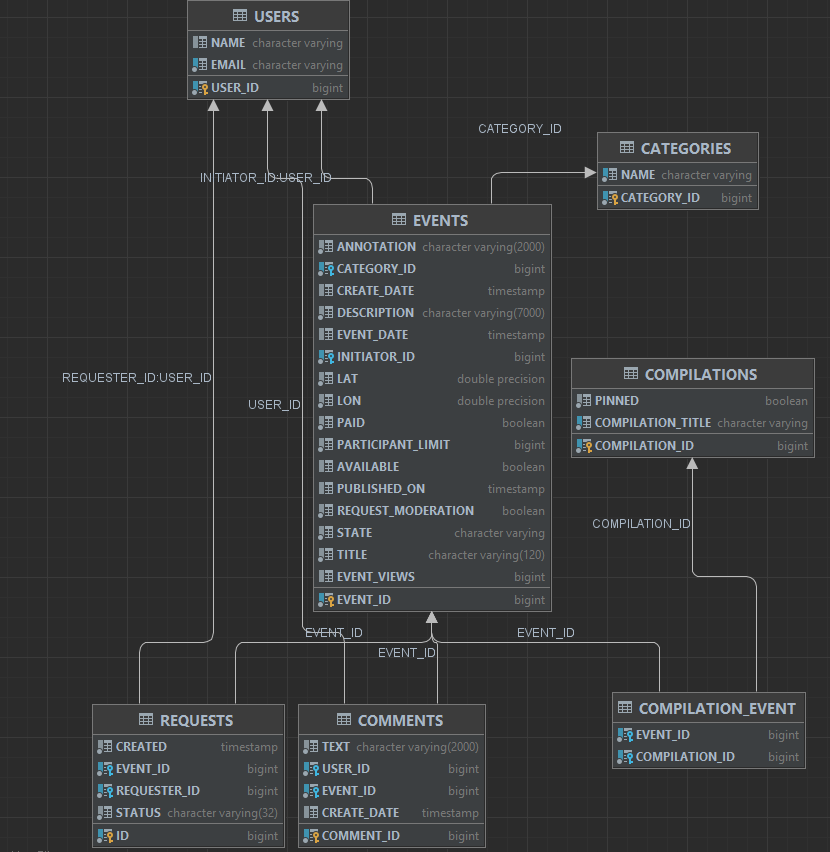
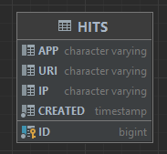

# Explore with me
___

*Проект, выполненный в рамках Яндекс Практикума, состоящий из двух сервисов (сервис статистики, основной сервис).*
___

Это приложение-афиша, где можно предложить какое-либо событие 
от выставки до похода в кино и собрать компанию для участия в нём.
 ## Стек

### Функционал

Подразумевается, что оба сервиса ExploreWithMe работают внутри VPN.
С внешним миром сервисы связывает сетевой шлюз. Он контактирует с системой аутентификации и авторизации, а затем перенаправляет запрос в сервисы. То есть, если шлюз пропустил запрос к закрытой или административной части API, значит, этот запрос успешно прошел аутентификацию и авторизацию.

Взаимодействие между сервисами происходит через REST с использованием RestTemplate.

- **Основной сервис** содержит всё необходимое для работы продукта (API  разделен на Public, Private, Admin);
- **Сервис статистики** хранит количество просмотров и позволяет делать различные выборки для анализа работы приложения.

### Спецификация 
<a href="https://petstore.swagger.io/?url=https://raw.githubusercontent.com/yandex-praktikum/java-explore-with-me/main/ewm-main-service-spec.json">
API main service
</a>
 
<a href="https://petstore.swagger.io/?url=https://raw.githubusercontent.com/yandex-praktikum/java-explore-with-me/main/ewm-stats-service-spec.json">
API statistics service
</a>

---
### ERD

***main service***

***statistics service***

### Возможности по улучшению
Использовать WebClient вместо RestTemplate.

### Тестирование приложения
Предусмотрены postam-тесты в папке "Postman".